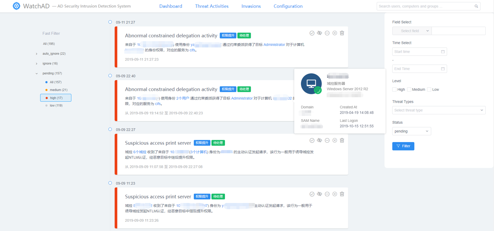
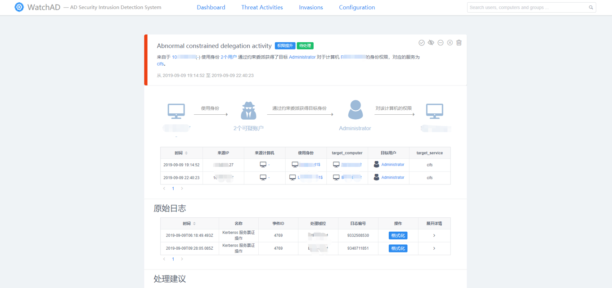
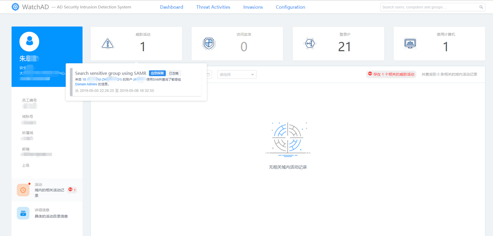
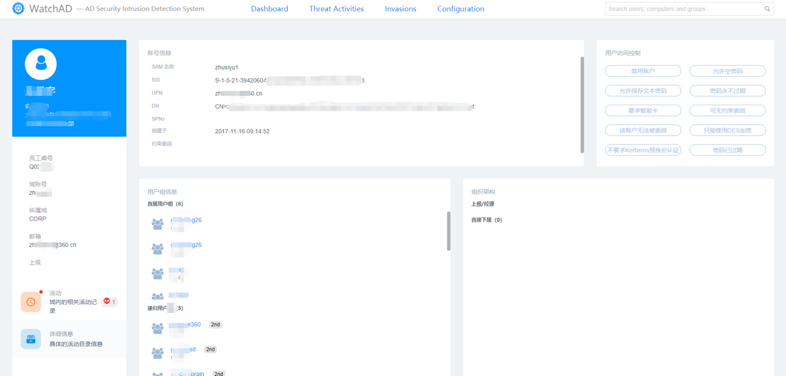
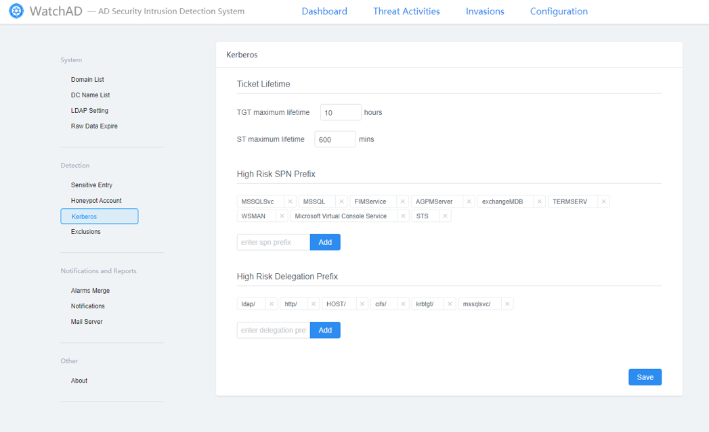

# WatchAD-Web

   

> A simple web platform for WatchAD

本项目是[WatchAD](https://github.com/0Kee-Team/WatchAD)的定制化Web平台，为了能够对WatchAD产生的告警数据进行简单运营而开发，前后端分离，前端使用 `Vue + View-Design`，后端使用`Flask`。

作为内部安全人员运营使用的平台，仅能保证功能基本正常，如有BUG可提issue。功能实现参照Microsoft ATA，条件允许的话可以自行定制化开发。

如果你所在的企业没有足够的开发资源，或者你是一个人的安全部，那么你可以暂时使用这个平台进行基本的安全运营工作。至于响应式、可视化、UI设计等优化暂不在本项目的短期规划之内（我一个人忙不过来）。

> 本项目的界面布局和功能设计，均参考Microsoft ATA之后进行改进。

> **！使用请注意：本项目没有进行访问控制和用户管理，请自行定制开发或者对该网站的访问设置ACL以确保WatchAD网站安全**

## 支持功能

* 威胁活动展示、筛选、状态处理
* 对威胁活动添加忽略、排除规则
* 合并威胁活动为入侵事件
* 搜索域内实体，实体的活动、详细信息展示
* 配置WatchAD相关的检测选项设置
* ... ...

## // TODO

* English Document

* Dashboard 页面
* 详细化部分告警的内容展示
* English version

## 截图预览

威胁活动：



入侵事件：


威胁活动详情：



实体活动：



实体详细信息：



设置：




## 安装

### 配置修改
首先，修改 `{WatchAD-Server}/config/database_config.py`文件中的数据库配置与WatchAD一致。

### Docker启动
编译及运行测试环境：
```
    docker-compose build
    docker-compose up -d
```